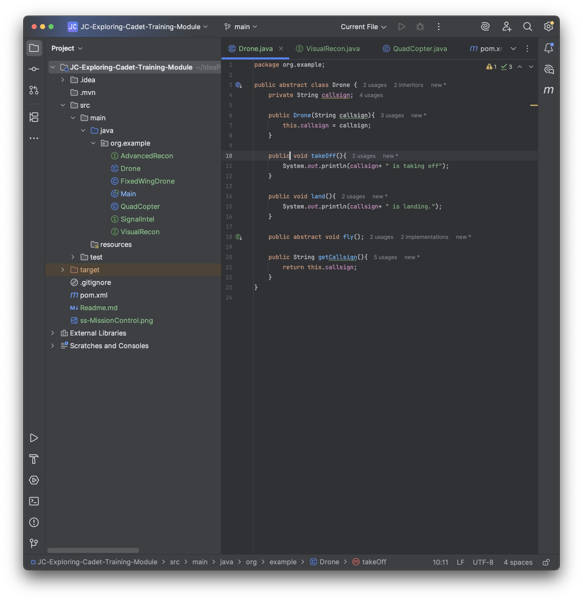
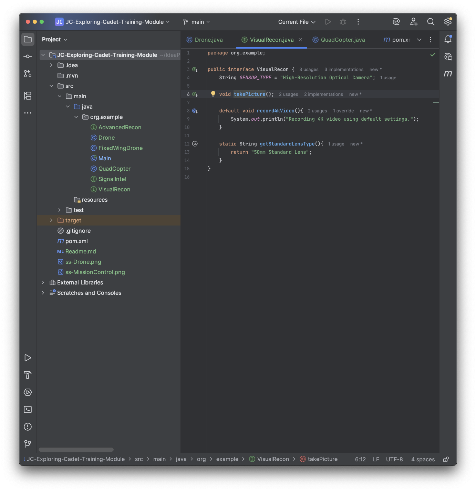
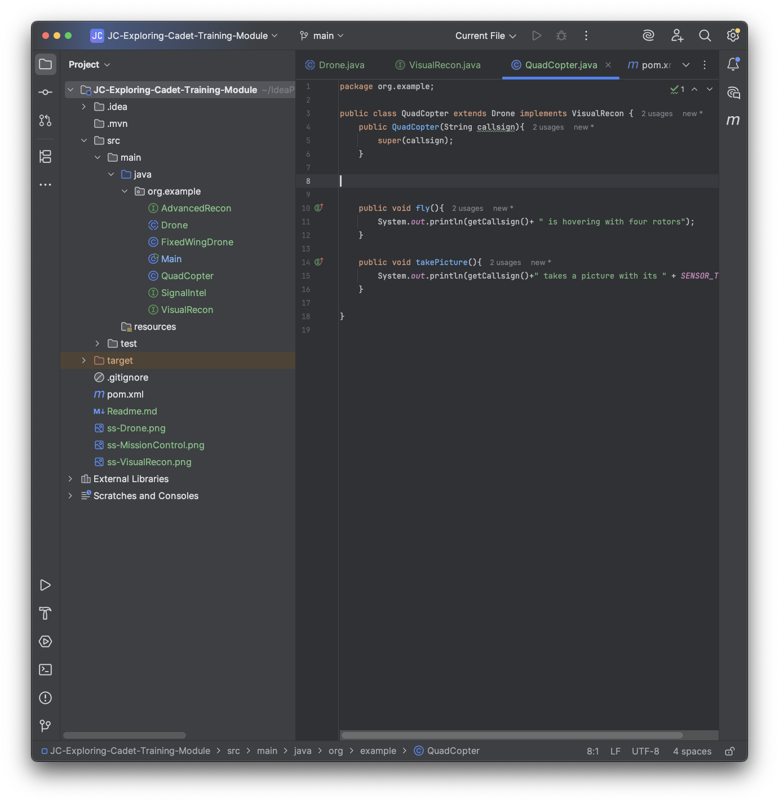
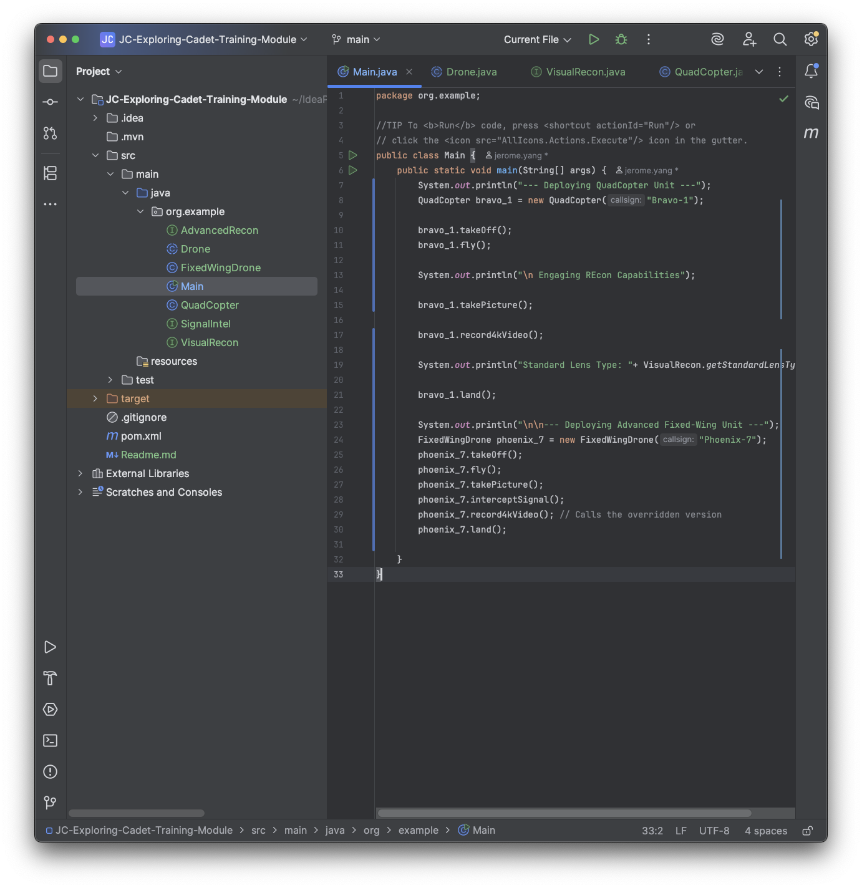
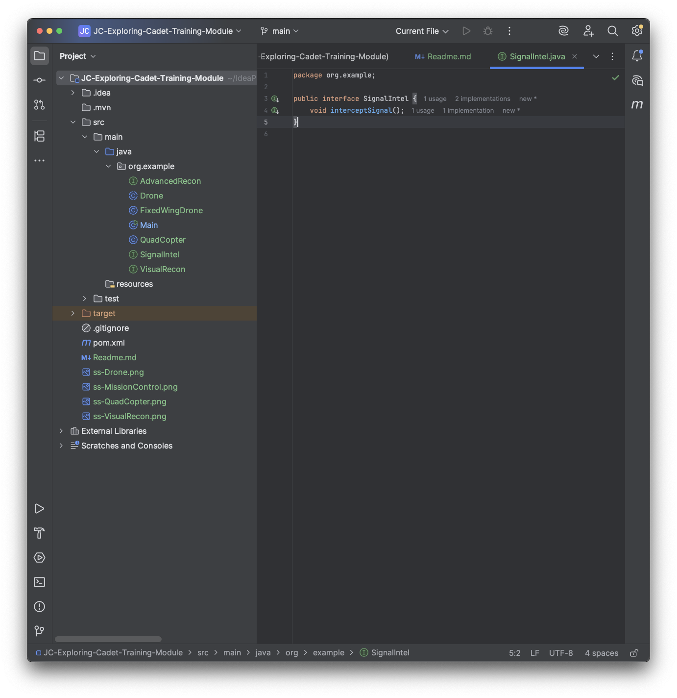
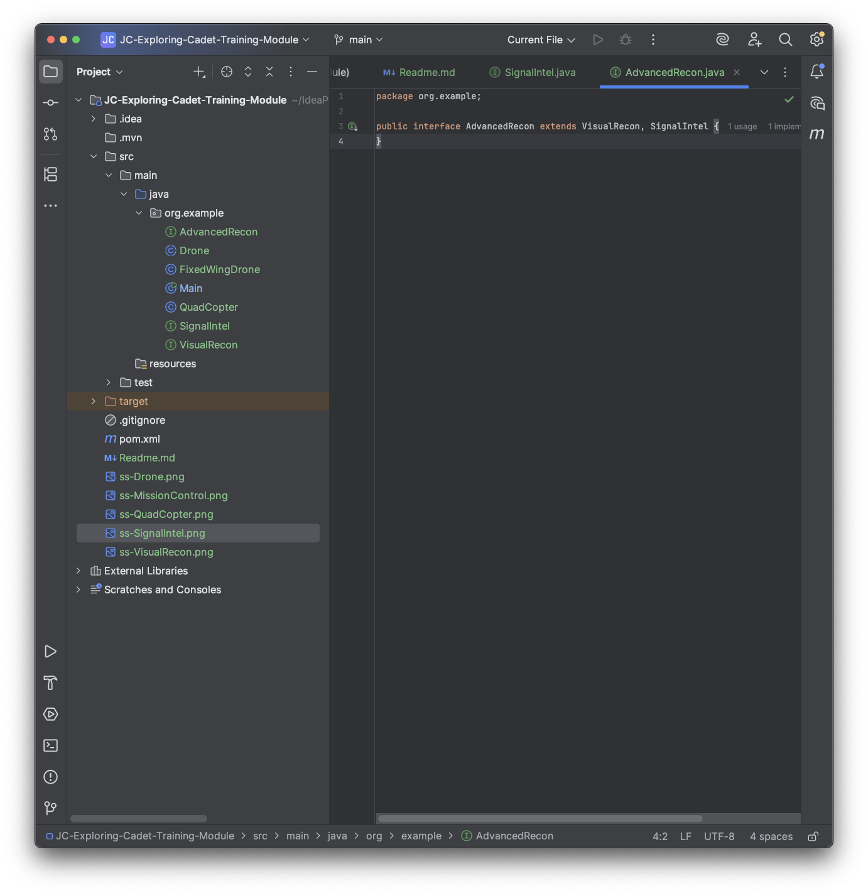
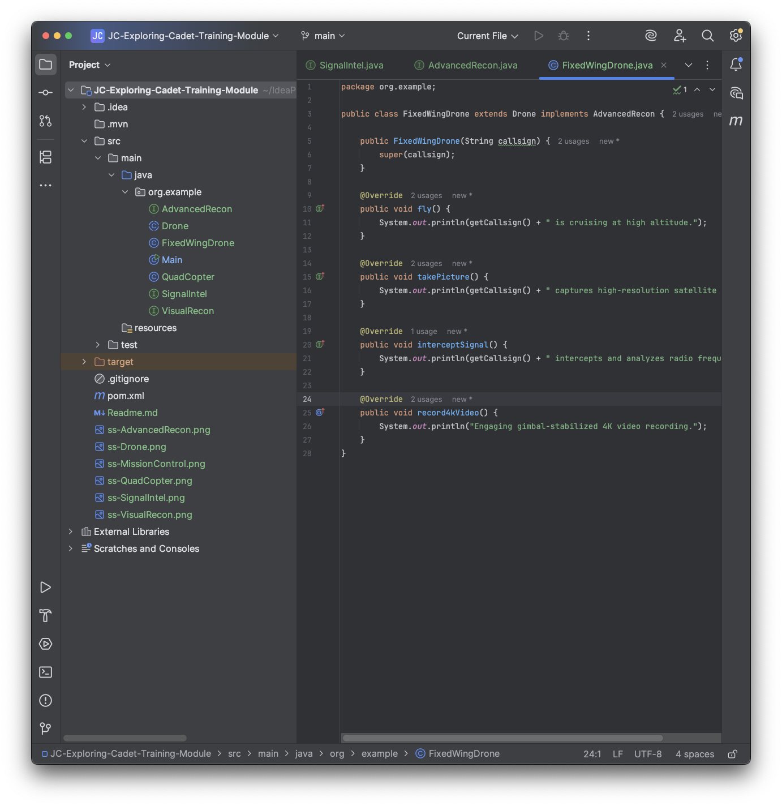

# Cadet Training Module: Java Inheritance and Interfaces

Name: Jerome Yang
### CLASS: Drone

### CLASS: VisualRecon

### CLASS: QuadCopter

### CLASS: MissionControl

### CLASS: SignalIntel

### CLASS: AdvancedRecon

### CLASS: FixedWingDrone

